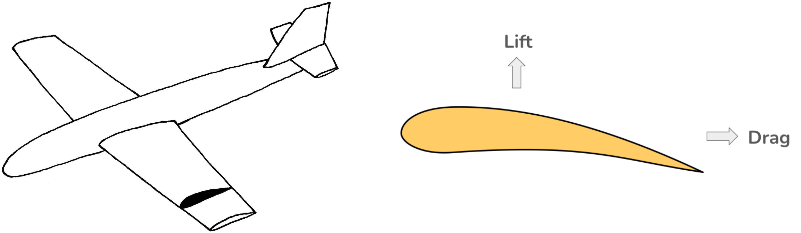

# Airfoil Shape Optimization through Neural Network Input Optimization

## Idea
**Airfoils** are fundamental shapes that underpin aircraft wing design, imparting an airplane its aerodynamic properties like **lift** and **drag**.

One measure of an airfoil's quality is its lift-to-drag ratio. The higher the better, maximizing upward force with least resistance.

#### Objectives
We build a **framework to design airfoils**. In particular we target the following two problems:
1. Given a particular lift-to-drag ratio, design airfoils for it.
2. Design an airfoil to maximize lift-to-drag ratio.

#### Solution Approach
We use a deep learning approach to solve the problem. The process consists of the following three steps:
1. Generate a lot of airfoils and corresponding L by D ratios.
2. Train a deep neural network to learn the mapping from: shape -> L/D ratios.
3. Freeze the network and optimize the inputs to the network instead.

Simply put, we learn the shape -> L/D mapping using a neural network and then run gradient descent on the shape input to design the airfoil.

The animation below shows the optimization process for generating an airfoil with a specified L/D ratio of 75. NACA0006 is chosen as the initial airfoil which is iteratively modified using gradient descent to generate the final shape.

Apart from the two main objectives discussed above, we can optimize designs for achieving other optimization objectives by simply changing the loss function. In that sense, the framework is really flexible.

## Process
We follow a 3 step procedure for design:
1. Data Generation
1. Training a Network
1. Performing input optimization

## Data Generation
To learn the shape -> L/D mapping we need a large training set T = {shape, L/D}. We generate this as follows:
1. Start with an initial set of 1235 airfoils available from [Airfoil Database](https://github.com/npuljc/Airfoil_preprocessing?tab=readme-ov-file)
1. Make a Train-Dev-Test split of 900-170-165 airfoils.
1. Parameterize the airfoils using Catmull-Rom splines.
1. Perturb the spline control points with noise to generate new shapes.
1. Input the shapes to XFoil and calculate L/D ratios for each shape.

We use the Catmull-Rom spline parameterization as the spline passes through all the control points making it very intuitive. Also the spline has C1 (and therefore G1) continuity. This is helpful as if we used coordinates on the surface then adding noise to the coordinates to generate new shapes would generate non-smooth shapes whereas, if we instead perturb the control points then the resulting airfoil generated would again be C1 smooth by design.

To generate L/D ratios we use XFoil as it is computationally cheap to run, allowing us to generate a large dataset easily.

### Generating New Shapes
To learn a good mapping we need to train the network on a good variety of shapes. To generate a new shape we fix a perturbation level chosen from HV, MV or LV which stand for High Variance, Mid Variance and Low Variance then we perturb each point as $x = x + x * noise$.

The dataset is generated through the following sequential process:
1. Perturb each airfoil in the training data to produce H high variance, M mid variance and L low variance airfoils.
2. For each high variance airfoil to produce M and L mid and low variance airfoils.
3. Perturb each mid variance to produce L low variance airofoils.

In the end we will have the following airfoils:
- original
- original_HV
- original_MV
- original_LV
- original_MV_LV
- original_HV_MV
- original_HV_LV

where the original_HV denotes that each original airfoil is perturbed using high variance to produce H new airfoils and original_HV_MV means each high variance airfoil generated from the original airfoil is again perturbed by mid variance noise to generate M new airfoils.

Through experimentation we found that noise levels of HV = 0.2, MV = 0.15 and LV = 0.1 worked well.

### Dataset Estimates
We generate the data in "packets", each packet is generated using H = 5, M = 5 and L = 5 and a total of 100 such packets are generated.
This gives us a total of 8.5 million training examples.

## Training a Network
The final network architecture that we produced is a fully connected neural network with 10 layers and 300 nodes in each layer.
Each layer consists of the following modules:
1. Linear transformation
1. ReLU activations
1. Batch Normalization

We choose the size to be large enough to produce loss of less than 1 on the validation data. This corresponded to an accuracy of 2.1% on the test set.

## Performing input optimization
This is where the airfoil design takes place. We input an airfoil shape using our Catmull-Rom parameterization and then calculate the loss for the objective that we want to achieve. Then we backpropagate through the network to calculate the gradient of the loss with respect to the input shape. Using this gradient we run gradient descent only on the input to optimize the shape.

## Tips and Tricks for Best Results
Accuracy of the predictions can be further improved by constructing model ensembles using the checkpoints from a training run. We observed drop in dev set loss from 0.92 -> 0.53 using an ensemble of the top 5 models by validation error.

## Helpful Inputs
- [Emil Biju](https://github.com/emilbiju/) - model training advice.

## References
- [For airfoil database](https://github.com/npuljc/Airfoil_preprocessing?tab=readme-ov-file)